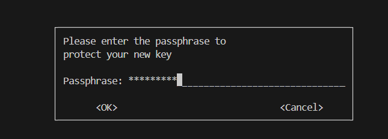

# Project Implementation Guidelines Step by Step

## Project Overview

### This project involves 3 parts

1. Create PGP key pairs to encrypt IAM access keys

2. Create Remote S3 Backend and IAM user for the S3 Backend

3. Provision AWS Infrastructure and store state files in remote s3 backend

## Create PGP key pairs to encrypt IAM access keys

#### Install GnuPG Packages
`sudo apt install gnupg`
#### Generates a GPG key pair, consisting of a public key and a private key.
`gpg --full-generate-key`

`1. Select RSA Key Types`

`2. Set expire date for the key pairs`

`3. Confirm to create key pairs`

`4. Set passphrase to protect your private key`

`5. Key pairs is successfully created in your your home directory of with hidden folder called .gnup`

#### Displays all public keys in your GPG keyring, showing them long-format key IDs

`gpg --list-keys --keyid-format LONG`

#### Create pub_keys directory to store public keys files

`mkdir pub_keys`

#### Exports the public key with the specified key ID to a binary file

`gpg --export C7C80C57F21F18C4C4A1C8983CA892CE70FB52C5 > pub_keys/key.bin`

#### Converts the binary public key file into a base64-encoded text file

`base64 -w 0 pub_keys/key.bin > pub_keys/pubkey.txt`

## Create Remote S3 Backend and IAM user for the S3 Backend

1. Go to backend directory
2. Create `terraform.tfvars` vars files for storing variable values
3. `terraform init` 
4. `terraform fmt`
5. `terraform validate`
6. `terraform plan`
7. `terraform apply -auto-approve`
8. `mkdir priv_keys`
#####  Retrieves an encrypted secret from Terraform, decodes it from base64, and saves it as a binary file
9. `terraform output -raw encrypted_secret | base64 --decode > priv_keys/encrypted_secret.gpg`
##### Decrypts the encrypted secret file using your private key
10. `gpg --pinentry-mode loopback --decrypt priv_keys/encrypted_secret.gpg`

## Provision AWS Infrastructure and store state files in remote s3 backend

#### Remote S3 Workflow Diagram Overview

1. Configure profile for S3 backend to store terraform state files
`aws configure --profile tf-s3-state-handler`

2. Create `terraform.tfvars` vars files for storing variable values

3. `terraform init` 

4. `terraform fmt`

5. `terraform validate`

6. `terraform plan`

7. `terraform apply -auto-approve`